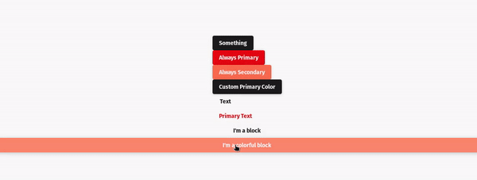

import {Props, Playground} from 'docz'
import ButtonDoc from './src/docs/Button.doc'
import Button from './src/lib'

## Introduction

Button Component is a react component that creates a customizable button based on
Material Design style guide.

## Installation

You can install it using `yarn` or `npm`.

Using `yarn`:

    yarn add @redwallsolutions/button-component-module

Using `npm`:

    npm install @redwallsolutions/button-component-module

## Props

<Props of={ButtonDoc}/>

## Usage

### Simplest Form

<Playground>
    <Button>I'm Button</Button>
</Playground>

### Passing a handler

<Playground>
    <Button onClick={()=>alert("UUUUUU")}>
        Click me
    </Button>
</Playground>

### Text Variant

<Playground>
    <Button appearance="secondary">
        Contained Variant
    </Button>
    <Button variant="text">
        Text Variant
    </Button>
</Playground>

### Loading State

<Playground>
    <Button isLoading={true}/>
</Playground>

## Customization

### Theme Prop

The `theme` is a property used by [theming-component-module](https://github.com/redwallsolutions/theming-component-module). It 
accepts an `object` with the following structure:

	{
        mode: 'light' | 'dark',
        default?: 'any color string'
        primary?: 'any color string',
        secondary?: 'any color string',
        defaultContrast?: 'any color string',
        primaryContrast?: 'any color string',
        secondaryContrast?: 'any color string',
        defaultDark?: 'any color string',
        primaryDark?: 'any color string',
        secondaryDark?: 'any color string',
        defaultContrastDark?: 'any color string',
        primaryContrastDark?: 'any color string',
        secondaryContrastDark?: 'any color string'
    }

The only `theme` object attribute that is required is `mode`, it can accept either `light` or `dark` value. 
The others attributes are optional and can receive a string color.
It can be a **hex**, **rgb**, or any format you want.

### Appearance prop

The `appearance` is a property used to apply the correspondent `theme attribute` to customize the component.
For example, if you pass the following component props:

	<Button theme={{mode:'light', secondary: 'green'}} appearance="secondary" .../>

Then the button will use *secondary* value passed to `appearance` prop and customize all colors related to `theme attribute` **secondary** value.
As you assigned `green` to *secondary* `theme attribute`, the button now is **green**. 

Check this out:

<Playground>
    <Button theme={{mode: 'light', secondary: 'green'}} appearance="secondary">
        Custom Appearance
    </Button>
</Playground>